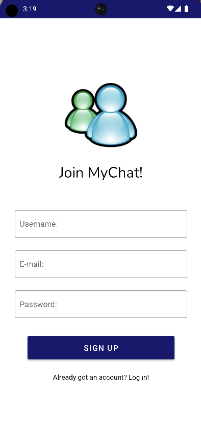
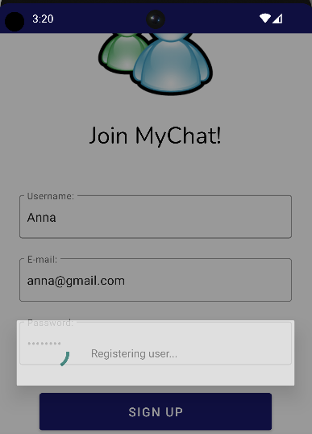
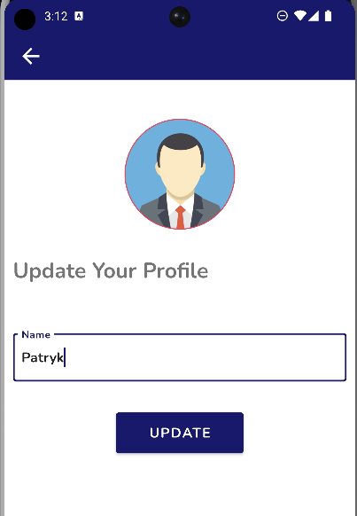
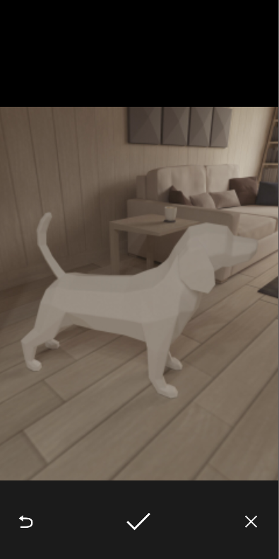
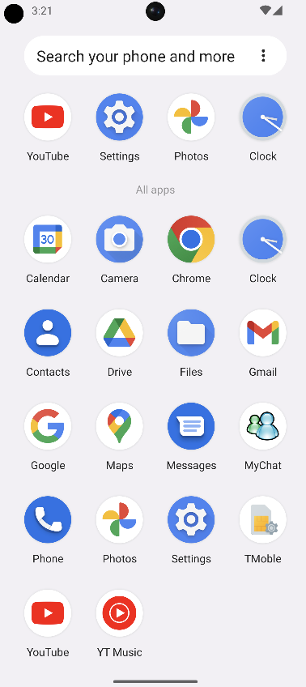

# 🚀 MyChat Android App

* [📝 Description](#description)
  * [Overview](#overview)
  * [Discover the Features](#features)
* [🔧 Technologies](#technologies)
* [📸 Screenshots](#screenshots)
* [📋 TO-DO List](#todo)
* [🤔 Summary](#summary)
  
##  📠Description

###  Overview
Welcome to MyChat App - a sophisticated Android chat application developed with Android Studio and powered by the robust Firebase platform. This project aims to offer users a seamless and secure communication experience by integrating cutting-edge technologies, such as Firebase Authentication, Cloud Messaging, and other essential components.

The motivation behind MyChat App is to create not just a messaging platform, but a comprehensive solution that combines advanced features and technologies to deliver a user-friendly and enjoyable communication experience.

###  Discover the Features
MyChat App stands out with a variety of features designed to enhance the overall chat experience:

* 📱 Firebase Authentication: Users can create independent accounts securely, ensuring data privacy and accessibility.
  
* 📡 Firebase Cloud Messaging: Stay instantly informed with real-time notifications, thanks to Firebase Cloud Messaging, keeping users connected and up-to-date.
  
* 🔒 DataBinding and Lifecycle Components: Leveraging Android's DataBinding and Lifecycle components ensures efficient UI updates and streamlined lifecycle management.
  
* 🔄 Navigation Components: Android's Navigation Components make navigating through the app smooth and intuitive.
* 📷 Glide for Image Loading: Integrating Glide simplifies image loading, providing a smooth and responsive user interface.
* 🌐 Retrofit for Network Calls: Utilizing Retrofit simplifies and streamlines network calls, contributing to a more efficient application.
* 🌍 Localisation: The app adapts to the user's current localisation, offering a personalized and user-friendly experience.

These features collectively create a dynamic, feature-rich, and secure chat platform that caters to the diverse needs of users.

##  🔧 Technologies

MyChat App is a synergy of the following technologies and frameworks:

📱 Mobile Development:

* Android Studio 🚀

🔥 Backend:

* Firebase Authentication 🔒
* Firebase Cloud Messaging 📡
* Retrofit 🔄
* Firestore 🔥
* Firebase Storage 📂
* Kotlin Coroutines 🌐
* OkHttp Logging Interceptor 📶

These technologies work in unison, providing a robust foundation for Android chat application.

##  📸 Screenshots

* #### Welcome screen

 

* #### Sign up

 

* #### Friends list and chat history

 

* #### New message notification

 

* #### Chat and localisation feature in action

 

* #### Update profile and take your own picture

 

* #### Quick access menu

 

##  📋 TO-DO List

 - [x] Implement Firebase Authentication for user account creation and login.
 - [x] Utilize Firebase Cloud Messaging for real-time notifications.
 - [x] Implement Shared Preferences for managing and accessing the friends list.
 - [x] Incorporate localisation features for a personalized user experience.
 - [ ] Enhance chat features, such as multimedia support and message formatting.
 - [ ] Explore options for group chats and additional customization options.

##  🤔 Summary

MyChat Android App is an advanced messaging application developed in the Android Studio environment, leveraging the robust Firebase platform. This project not only provides standard communication features but also integrates modern technologies such as Firebase Authentication, Cloud Messaging, Firestore, and more to ensure users have a secure, efficient, and enjoyable experience. 

The MyChat app stands out with rich functionality, encompassing the authentication realm through Firebase Authentication. This allows users to create and log in to independent accounts securely and privately. Additionally, thanks to Firebase Cloud Messaging, users receive real-time notifications, keeping them in constant communication with friends. 

MyChat makes use of advanced technologies such as DataBinding and Android Lifecycle Components, resulting in efficient UI updates and optimal lifecycle management. The Android Navigation Components contribute to smooth and intuitive navigation within the application. 

An essential aspect of MyChat is the integration of Glide for image loading, contributing to a smooth user interface and responsiveness. To streamline network calls, the app employs Retrofit and Kotlin Coroutines for handling asynchronous operations. 

Screenshot visuals showcase various features of MyChat, including the welcome screen, registration, friends list, chat history, new message notifications, location functionality, profile updates, and a quick access menu. 

The project also implements Firebase Storage for cloud data storage, further integrating with the Firebase platform. In the ToDo list, the application has successfully implemented Firebase Authentication, utilized Firebase Cloud Messaging, incorporated SharedPreferences for managing the friends list, and enabled location functionality. 

In summary, MyChat is a comprehensive and modern solution that combines advanced technologies to deliver users a secure, efficient, and satisfying communication experience. This project not only meets the specified requirements for Broadcasts, SharedPreferences, and location but also paves the way for future development, introducing planned features such as multimedia support and group chats. MyChat transcends being just a messaging app; it is a complete communication platform for contemporary users.
