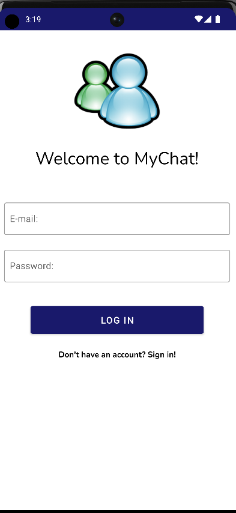
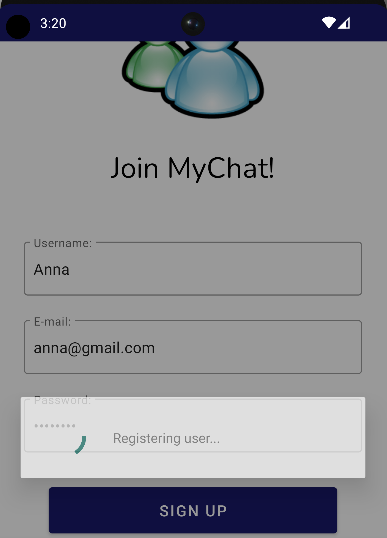
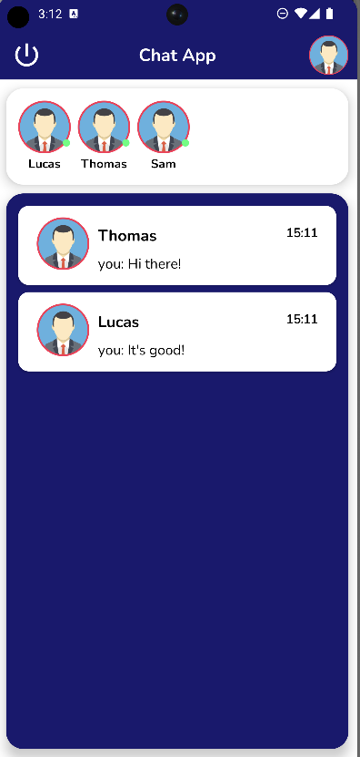
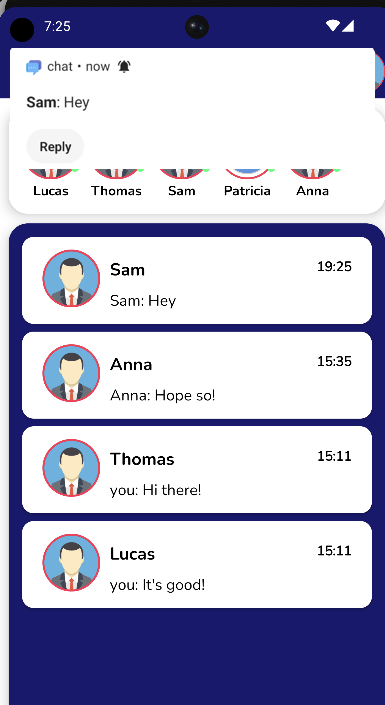
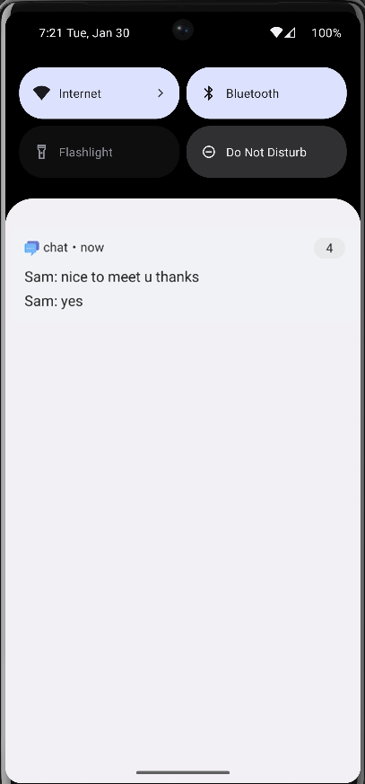
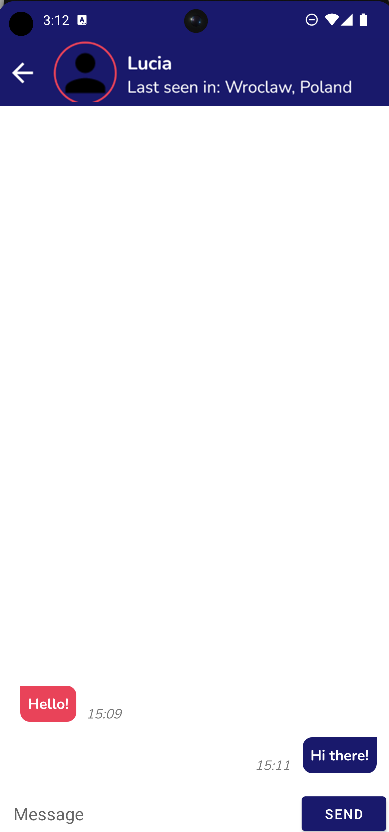
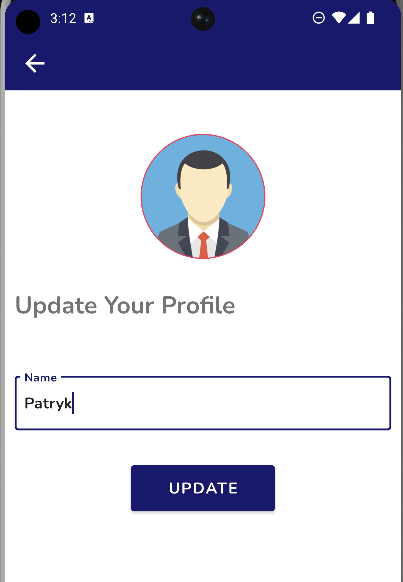
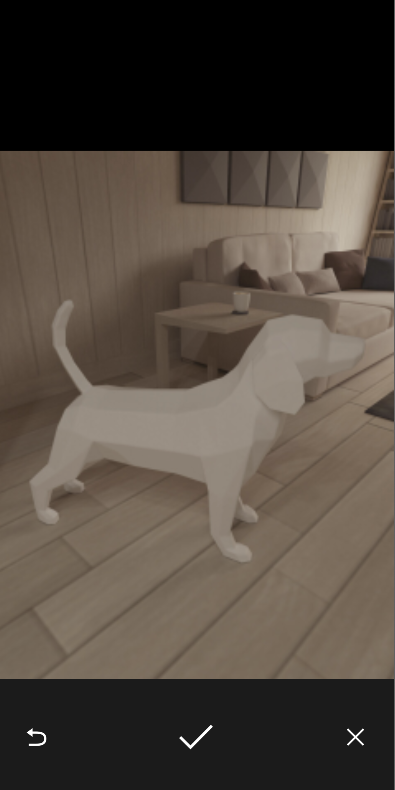
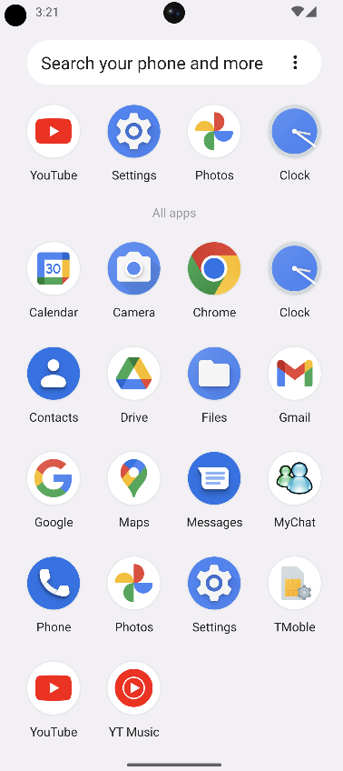

# 🚀 MyChat Android App

* [📝 Opis](#opis)
  * [Przegląd](#przeglad)
  * [Odkryj funkcje](#funkcje)
* [🔧 Technologie](#technologie)
* [📸 Zrzuty ekranu](#zrzuty)
* [📋 Lista TO-DO](#todo)
* [🤔 Podsumowanie](#summary)
  
##  📝 Opis

###  Przegląd
Witaj w aplikacji MyChat - zaawansowanej aplikacji do czatowania na Androida, stworzonej w Android Studio i napędzanej solidną platformą Firebase. Ten projekt ma na celu zaoferowanie użytkownikom płynnego i bezpiecznego doświadczenia komunikacyjnego poprzez integrację nowoczesnych technologii, takich jak Firebase Authentication, Cloud Messaging i inne istotne komponenty.

Motywacją do stworzenia aplikacji MyChat była chęć stowrzenia kompleksowego rozwiązania łączącego zaawansowane funkcje i technologie, aby dostarczyć przyjazne i przyjemne dla użytkownika doświadczenie komunikacyjne.

###  Odkryj funkcje
Aplikacja MyChat wyróżnia się różnorodnością funkcji zaprojektowanych do usprawnienia ogólnego doświadczenia czatowania:

* 📱 Firebase Authentication: Użytkownicy mogą bezpiecznie tworzyć niezależne konta, zapewniając prywatność danych i dostępność.
* 📡 Firebase Cloud Messaging: Bądź natychmiast informowany dzięki powiadomieniom w czasie rzeczywistym dzięki Firebase Cloud Messaging, utrzymując użytkowników w łączności i na bieżąco.
* 🔒 DataBinding i Komponenty Cyklu Życia: Wykorzystanie DataBinding i Komponentów Cyklu Życia Androida zapewnia efektywne aktualizacje interfejsu użytkownika i zoptymalizowane zarządzanie cyklem życia.
* 🔄 Komponenty Nawigacji: Komponenty Nawigacji Androida sprawiają, że poruszanie się po aplikacji jest płynne i intuicyjne.
* 📷 Glide do ładowania obrazów: Integracja Glide upraszcza ładowanie obrazów, zapewniając płynny i responsywny interfejs użytkownika.
* 🌐 Retrofit do wywołań sieciowych: Wykorzystanie Retrofit upraszcza i usprawnia wywołania sieciowe, przyczyniając się do efektywniejszej aplikacji.
* 🌍 Lokalizacja: Aplikacja dostosowuje się do bieżącej lokalizacji użytkownika, oferując spersonalizowane i przyjazne dla użytkownika doświadczenie.
  
Te funkcje razem tworzą dynamiczną, bogatą w funkcje i bezpieczną platformę do czatowania, która zaspokaja zróżnicowane potrzeby użytkowników.

##  🔧 Technologie

Aplikacja MyChat to synergia następujących technologii:

📱 Platforma:

* Android Studio 🚀

🔥 Backend:

* Firebase Authentication 🔒
* Firebase Cloud Messaging 📡
* Retrofit 🔄
* Firestore 🔥
* Firebase Storage 📂
* Kotlin Coroutines 🌐
* OkHttp Logging Interceptor 📶

Te technologie współpracują ze sobą, dostarczając solidnych podstaw dla aplikacji do czatowania na Androida.

##  📸 Zrzuty ekranu

* #### Ekran powitalny

 

* #### Rejestracja

 

* #### Lista znajomych i historia czatów

 

* #### Powiadomienie o nowej wiadomości

 

* #### Czat i funkcja lokalizacji w działaniu

* #### Zaktualizuj profil i wgraj własne zdjęcie

 

* #### Widok z menu szybkiego dostępu

 

##  📋 Lista TO-DO

 - [x] Wdrożenie Firebase Authentication do tworzenia i logowania kont użytkowników.
 - [x] Wykorzystanie Firebase Cloud Messaging do powiadomień w czasie rzeczywistym.
 - [x] Implementacja Shared Preferences do zarządzania i dostępu do listy znajomych.
 - [x] Włączenie funkcji lokalizacji dla spersonalizowanego doświadczenia użytkownika.
 - [ ] Usprawnienie funkcji czatu, takich jak obsługa multimediów i formatowania wiadomości.
 - [ ] Wprowadzenie czatów grupowych i dodatkowych opcji ich dostosowywania.

##  🤔 Podsumowanie

MyChat Android App to zaawansowana aplikacja do czatowania, która została stworzona w środowisku Android Studio, wykorzystując solidną platformę Firebase. Projekt ten nie tylko dostarcza standardowe funkcje komunikacyjne, ale integruje również nowoczesne technologie, takie jak Firebase Authentication, Cloud Messaging, Firestore i wiele innych, aby zapewnić użytkownikom bezpieczne, efektywne i przyjemne doświadczenie. 

Aplikacja MyChat wyróżnia się bogatą funkcjonalnością, obejmującą obszar uwierzytelniania poprzez Firebase Authentication, co umożliwia użytkownikom tworzenie i logowanie się na niezależne konta w sposób bezpieczny i prywatny. Dodatkowo, dzięki wykorzystaniu Firebase Cloud Messaging, użytkownicy otrzymują powiadomienia w czasie rzeczywistym, utrzymując ich w stałej łączności z przyjaciółmi. 

MyChat korzysta również z zaawansowanych technologii takich jak DataBinding i Komponenty Cyklu Życia Androida, co przekłada się na efektywne aktualizacje interfejsu użytkownika i optymalne zarządzanie cyklem życia aplikacji. Komponenty Nawigacji Androida sprawiają, że poruszanie się po aplikacji jest płynne i intuicyjne. 

Ważnym elementem MyChat jest także integracja Glide do ładowania obrazów, co przyczynia się do płynności interfejsu użytkownika i responsywności. W celu usprawnienia wywołań sieciowych, aplikacja wykorzystuje Retrofit, a także Kotlin Coroutines do obsługi operacji asynchronicznych. 
Zrzuty ekranu prezentują różnorodne funkcje MyChat, w tym ekran powitalny, rejestrację, listę znajomych, historię czatów, powiadomienia o nowych wiadomościach, funkcję lokalizacji, aktualizację profilu, a także menu szybkiego dostępu. 

W projekcie zaimplementowano również Firebase Storage do przechowywania danych w chmurze, co stanowi kolejny element integracji z platformą Firebase. W ramach ToDo List, aplikacja wprowadziła wdrożenie Firebase Authentication, wykorzystanie Firebase Cloud Messaging, implementację SharedPreferences do zarządzania listą znajomych, oraz włączenie funkcji lokalizacji. 
Podsumowując, MyChat to kompleksowe i nowoczesne rozwiązanie, które łączy w sobie zaawansowane technologie, aby dostarczyć użytkownikom bezpieczne, efektywne i satysfakcjonujące doświadczenie komunikacyjne. Projekt ten nie tylko spełnia postawione wymagania dotyczące Broadcastów, SharedPreferences, lokalizacji, ale także otwiera drogę do dalszego rozwoju, wprowadzając planowane funkcje, takie jak obsługa multimediów i czaty grupowe. MyChat to nie tylko aplikacja do wysyłania wiadomości, to kompletna platforma komunikacyjna dla współczesnych użytkowników.
